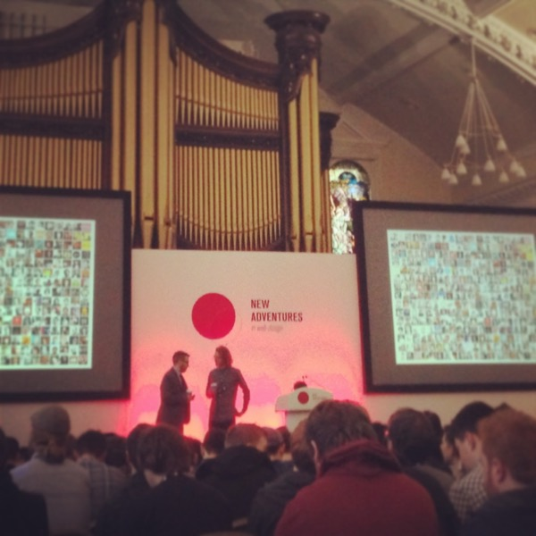
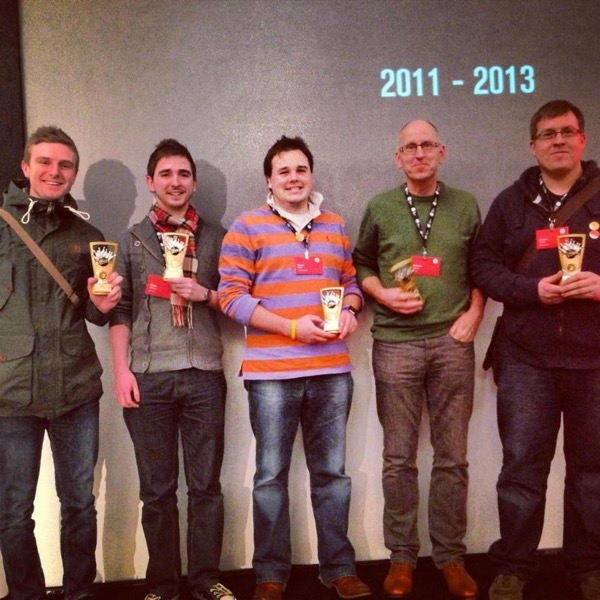
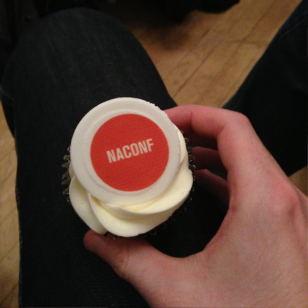
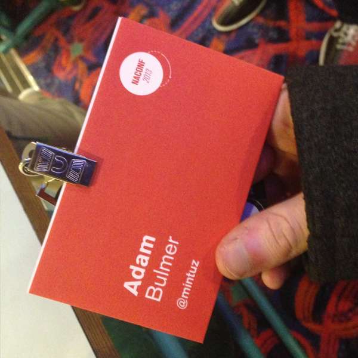
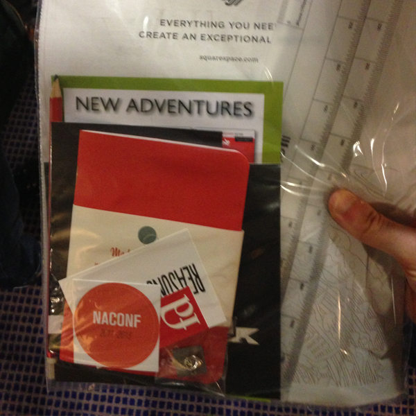
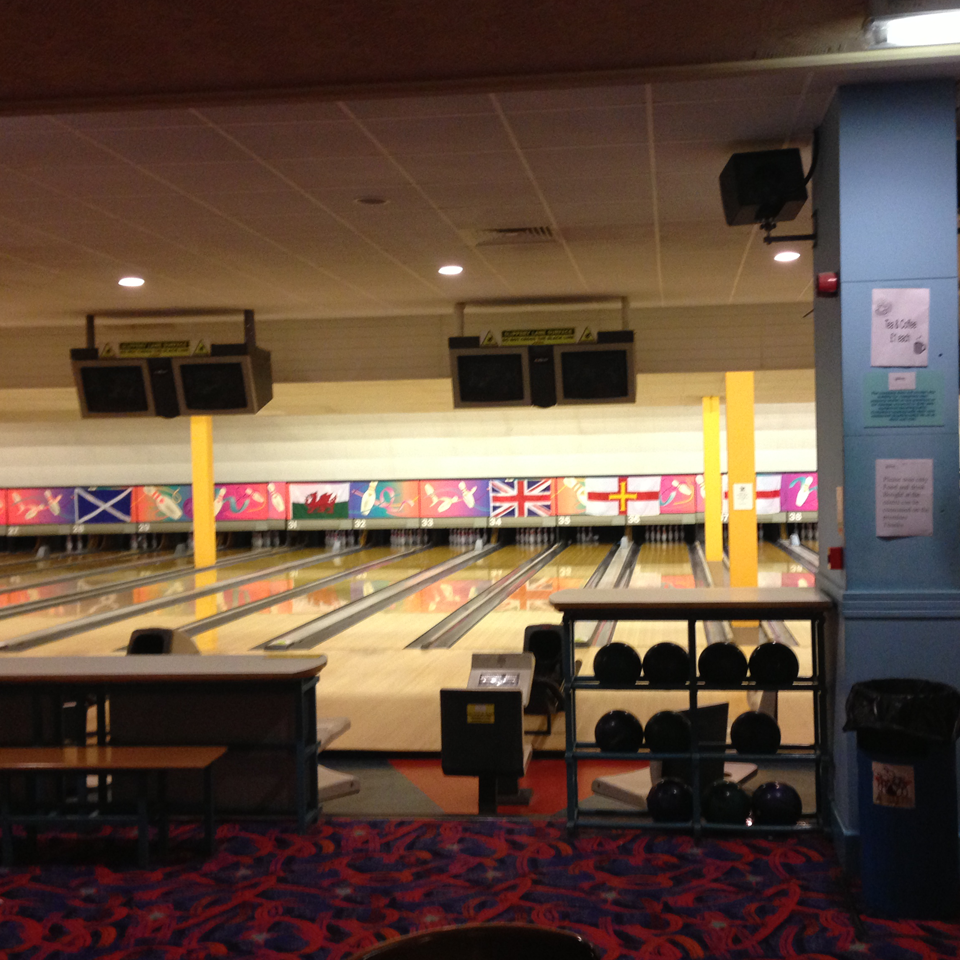
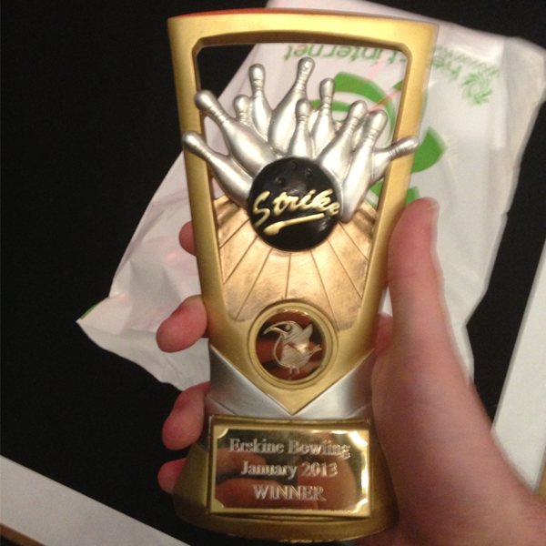
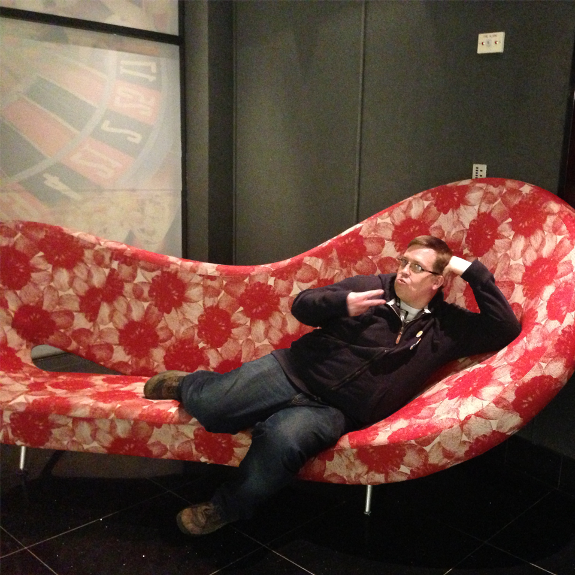

I should have written this blog post a week ago but with how busy I am currently, I have not had time.

A week ago I had the privilege of attending the New Adventures in Web Design Conference with [Forepoint](http://www.forepoint.co.uk), This was my first ever conference and hopefully not my last. If you cannot be bothered to read the rest of this post, Let me sum up the conference in one word. Inspiring.

It was an interesting angle on how I perceive Web Development, as the conference is aimed more towards designers I got to hear problems designers encounter all the time. The theme of the day seemed to revolve heavily around process, about the way that we work and it highlighted some key problems with how I currently work. 

I enjoyed all the talks. A couple of talks I found particularly useful were the talks by **Jessica Hische** and **Wayne Hemingway. **What I learnt from Jessica is that I should be Procrastiworking to stay motivated and get the tasks done. Wayne spoke about taking risks and how that can have a positive outcome on business. 

**Seb** was probably my favourite speaker and was a great start to the afternoon. He certainly got everybody out of their food comas. His talk was pure genius with live coding on a Commodore 64 and then demonstrated some JavaScript Prettyness. Seb had the whole hall laughing. I found his talk the most inspiring and I really want to get dirty with pixel particle work. 

I should also probably mention that the Forepoint bowling team (including [Richard Eskins](https://twitter.com/eskins)) won the bowling night hosted by [Erskine](http://erskinedesign.com/).

Here are some pictures, enjoy.

