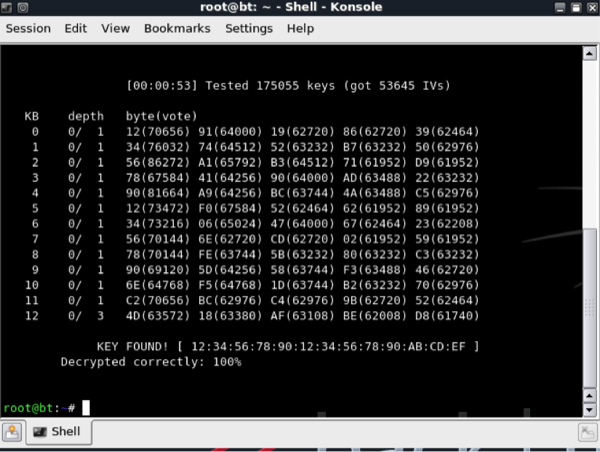

Recently I have noticed several WEP based wireless networks around my area with the majority of them using BT Home Hubs. This angers me, it has been known for several years WEP is insecure and allows young kids with basic knowledge of computing to hack your network. Here is why...

Two main versions of WEP exist, a 64bit key version and a 128bit key version. There is also a 256bit key but not all vendors support this version. All versions use an Initialisation vector of 24bits leaving a 40bit key, a 104bit key or a 232bit key.

WEP works by the wireless client sending an authentication request to the access point, the AP then responds with an authentication response including a challenge text in plain format. The wireless client then encrypts the challenge text with the WEP key and transmits the encrypted data to the AP, the AP then decrypts the encrypted message and if the transmitted message text matches the challenge text of the AP authentication is successful otherwise access is denied.

WEP can be cracked, by using freely available tools such as **aircrack-ng**. One of the main weaknesses of WEP is that the key used for authentication is also used for encrypting data on the wireless network. The same encryption key is used for each frame sent across the wireless link. By sniffing packets on the wireless network, it is possible to work out the key, which encrypted the data, and once this is known, it will also be possible to be authorised on the wireless network since it uses the same key.

WEP uses RC4 as its encryption algorithm. It is a stream cipher and is weak because of the initialization vector length. The initialization vector is used to randomize the key, which is then used to encrypt the data. With a stream cipher the key used to encrypt traffic should never be used twice but because the IV is short, there is a possibility that an IV collision will occur.  24bits are used for the IV which gives you a possible 16.7 million possibilities, on a network with large amounts of traffic, this value can be met very quickly therefore the IV values will have to be reused.

The IV values are also sent in clear text making it much easier to determine the key if the IV is used multiple times.
